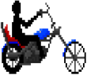

#  Wollok road

UTN - Facultad Regional Buenos Aires - Materia Paradigmas de Programación

## Equipo de desarrollo: 

- Sofia Baudo
- Marcelo Nahuel Buergo
- Ignacio Martin Cordoba
- Gonzalo Garcia Fontenla
- Micaela Beatriz Rodriguez Miño
 
## Capturas 
**Personaje principal**  
  

## Reglas de Juego / Instrucciones

El jugador debe obtener 30 puntos sin quedarse sin vida.  
Inicia con 100 de vida y 0 puntos.  
Para sumar puntos debe recolectar monedas.  
El jugador pierde puntos de vida cada vez que choca con algun obstaculo.  

Obstaculos:

Moto: Disminuye 15 de vida  
  
Auto: Disminuye 15 de vida  
 
Auto Fiesta: Disminuye 15 de vida  
  

Colectivo: Disminuye 30 de vida    

Potenciadores:

Corazon: Aumenta 15 de vida   
    
Moneda: Suma 10 puntos  

## Controles:

- Avanzar: w
- Retroceder: s
- Izquierda: a
- Derecha:  d  

